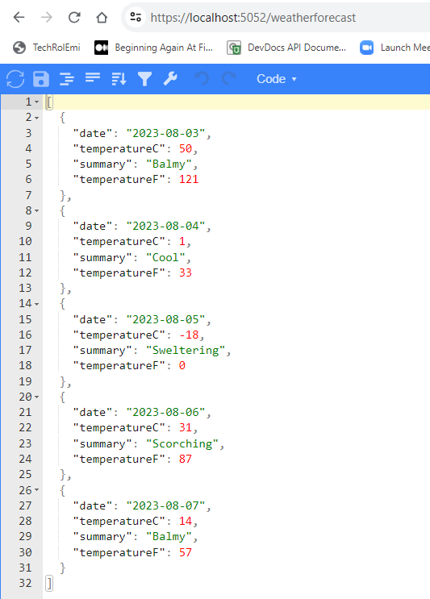

# ASP.NET Core WebAPI Using DOTNET CLI with --minimal Option

This ASP.NET WebApp is created using the `dotnet` CLI with `-minimal` option resulting in the controller logic being part of the main `Program.cs`

## Create a minimal CS project using dotnet cli 

From a powershell terminal, type the command `dotnet new webapi -minimal -f net7.0 -o myHowdyAPI`

```powershell

PS D:\DEVEL\C-SharpProjs\LINKEDIN_TRAINING_2023\.NET7API\hello> dotnet new webapi -minimal -f net7.0 -o myHowdyAPI
The template "ASP.NET Core Web API" was created successfully.

Processing post-creation actions...
Restoring D:\DEVEL\C-SharpProjs\LINKEDIN_TRAINING_2023\.NET7API\hello\myHowdyAPI\myHowdyAPI.csproj:
  Determining projects to restore...
  Restored D:\DEVEL\C-SharpProjs\LINKEDIN_TRAINING_2023\.NET7API\hello\myHowdyAPI\myHowdyAPI.csproj (in 324 ms).
Restore succeeded.

```

2. Build and run the program

```powershell
PS D:\DEVEL\C-SharpProjs\LINKEDIN_TRAINING_2023\.NET7API\hello\myHowdyAPI> dotnet run
Building...
info: Microsoft.Hosting.Lifetime[14]
      Now listening on: https://localhost:5052
info: Microsoft.Hosting.Lifetime[0]
      Application started. Press Ctrl+C to shut down.
info: Microsoft.Hosting.Lifetime[0]
      Hosting environment: Development
info: Microsoft.Hosting.Lifetime[0]
      Content root path: D:\DEVEL\C-SharpProjs\LINKEDIN_TRAINING_2023\.NET7API\hello\myHowdyAPI
```

## Output

Open the browser to https://localhost5052/weatherforecast/

